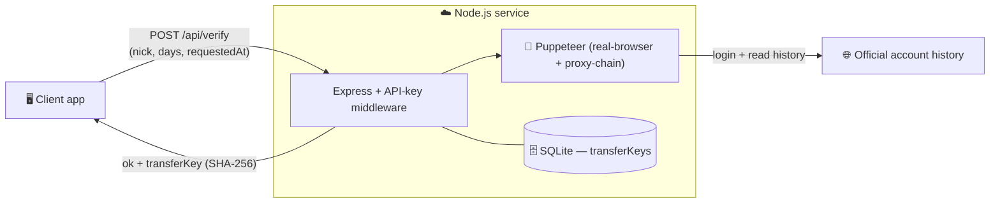

<div align="center">

# 🪙 Tibia Coin Monitoring — Payment Verification API

**Node.js API** · Confirms in-game-currency payments via web scraping · Anti-bot · In production


An HTTP API that automatically confirms whether a payment was made in **in-game currency**, by logging into
the account and **scraping its official transfer history** with an anti-bot real browser. Each confirmed
payment yields a unique key so it can **never be reused**.

</div>

> **Note on source code.** This repository is a **public showcase** of a commercial product.
> The full source is private; this README documents the architecture and engineering decisions.
> Code walkthrough available on request.

---

## ✨ What it does

Manually confirming each in-game-currency transfer is slow and fraud-prone (the same payment could be
reused to unlock different services). This API removes the manual step:

1. In the client app, the user clicks **"Sent"** after transferring the coins.
2. The app records `requestedAt` (the click time) and calls the API with the **nick**, **plan (days)** and that timestamp.
3. The API **logs into the account, reads the transfer history**, and looks for a compatible transfer within
   a **1-hour window** of `requestedAt`.
4. If found, it returns `ok: true` and a unique **`transferKey`** (SHA-256) to persist and block reuse of
   that same payment.

> Each verification runs a real login + scrape (typically 1–3 minutes).

---

## 🏗️ Architecture



---

## 🔒 Engineering highlights

- **Payment idempotency by design.** Each matched transfer is hashed into a unique **SHA-256 `transferKey`**
  persisted in SQLite — so the exact same payment can never be accepted twice.
- **Time-windowed matching.** A transfer only counts if it falls within **1 hour** of the user's click,
  which cuts down false positives from unrelated historical transfers.
- **Anti-bot scraping.** Uses `puppeteer-real-browser` + `proxy-chain` to get through the official site's
  bot protections reliably.
- **Authenticated surface.** Every `/api/*` route requires a shared key (`X-API-Key` or `Bearer`), with a
  public `/health` endpoint for monitoring; a clear error contract (401 missing/invalid key, 503 not configured).
- **Long-job aware.** Because a verification takes minutes, the design accounts for the cost of each call
  rather than treating it as a cheap lookup.

---

## 🧰 Tech stack

| Concern | Technology |
|---|---|
| **API** | Node.js · Express 4 |
| **Scraping** | `puppeteer-real-browser` · `proxy-chain` |
| **Storage** | SQLite (`better-sqlite3`) |
| **Auth** | Shared API key (`X-API-Key` / `Bearer`) |
| **Config** | `dotenv` (port, API key, credentials) |
| **Tooling** | CLI verifier (`cli-verify.js`) · health check |

---

## 📡 API at a glance

```
GET  /health            → public liveness check
POST /api/verify        → { nick, days, requestedAt }  →  { ok, transferKey }
                          requires header: X-API-Key (or Authorization: Bearer)
```

| Status | Meaning |
|---|---|
| `200` | Verification ran (see `ok`) |
| `401` | API key missing or incorrect |
| `503` | API key not configured on the server |

---

## 👤 Author

**Carlos Alberto C. de Azevedo Filho** — Backend / Python Developer
🌐 [patoxzor.github.io](https://patoxzor.github.io) · 💼 [LinkedIn](https://www.linkedin.com/in/azevedoocarlos/) · 🐙 [GitHub](https://github.com/Patoxzor)
